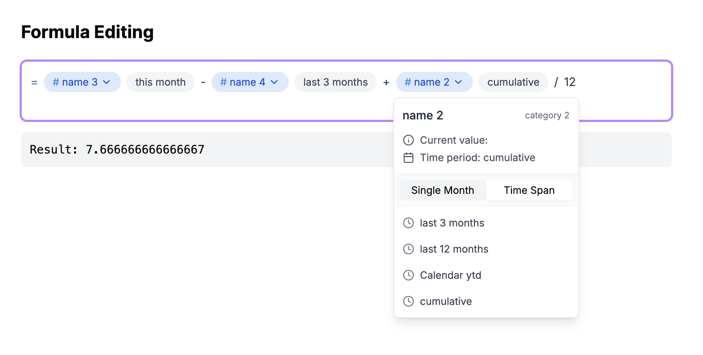

### Demo




## Project Structure

```
formula-input/
├── app/                    # Next.js app directory
├── components/            # React components
│   ├── ui/               # Reusable UI components
│   ├── formula-input.tsx # Main formula input component
│   ├── suggestions.tsx   # Formula suggestions component
│   └── tag.tsx          # Tag component
├── lib/                  # Utility functions and configurations
├── store/               # Zustand store
└── types/               # TypeScript type definitions
```

## Usage

The application provides a formula input interface where users can:

1. Enter mathematical formulas
2. Get real-time suggestions
3. Use tags for formula categorization
4. Get results of formula

## Acknowledgments


- [Next.js](https://nextjs.org/)
- [Tailwind CSS](https://tailwindcss.com/)
- [Radix UI](https://www.radix-ui.com/)
- [Lucide Icons](https://lucide.dev/)
# formula-editing
